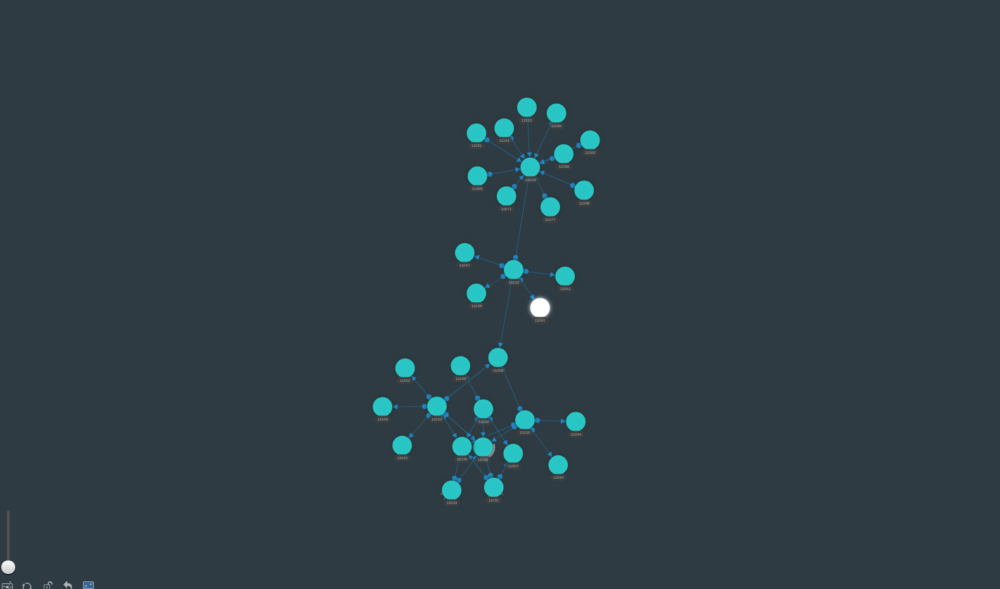

# ZoomCharts Neo4j integration example



## Stack

* Frontend: ES6, Babel, [ZoomCharts](https://zoomcharts.com/en/)
* Webpack for building web assets

## Quickstart

### Setup

```bash
$ npm install
```

### Run locally

* Clone this project from [GitHub]().
* Run the App inside the Webpack Dev Server:

```bash
# run in developement mode (refreshes the app on source code changes)
$ npm run babel
$ npm run dev

# builds the production version with client assets in "dist" directory
$ npm run build
```

When running in "dev" mode navigate to [http://localhost:10001/](http://localhost:10001/) to see the application.

After executing the `npm run build` command,  open local file "index.html" in your browser.