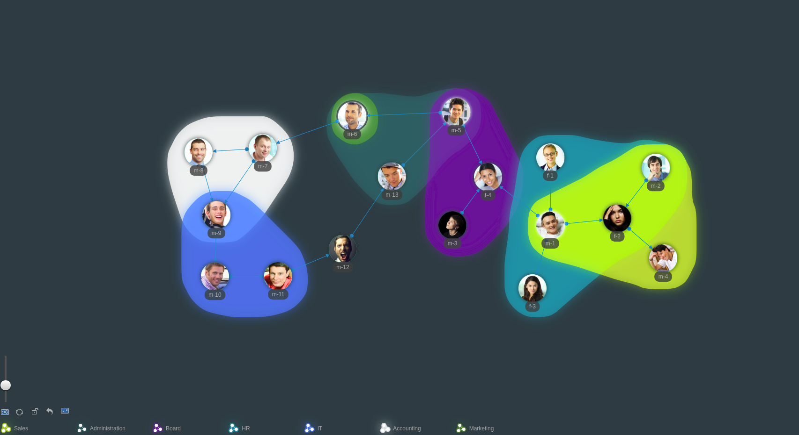
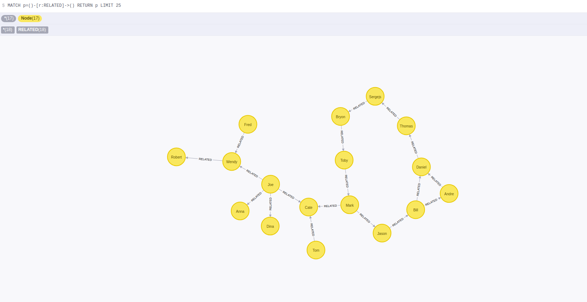

# Neo4j NetChart example - neo4j-driver



Example data  [json](./neo4j.json), [csv](./neo4j.csv)

## Stack

* [Neo4j Bolt JavaScript Driver](https://github.com/neo4j/neo4j-javascript-driver) or [Neo4j Driver 1.6 for JavaScript](https://www.npmjs.com/package/neo4j-driver)
* Neo4j
* Frontend: ES6, Babel, [ZoomCharts](https://zoomcharts.com/en/)
* Webpack for building web assets

## Quickstart

### Setup

```bash
$ npm install
```

### Run locally

* Start Neo4j ([Download & Install](https://neo4j.com/docs/operations-manual/current/installation/)) locally and open the [Neo4j Browser](http://localhost:7474/browser/). 
* Create dataset. [Import example data](https://neo4j.com/docs/developer-manual/current/cypher/clauses/load-csv/).
* Clone this project from [GitHub]().
* Run the App inside the Webpack Dev Server:

```bash
# run in developement mode (refreshes the app on source code changes)
$ npm run babel
$ npm run dev

# builds the production version with client assets in "dist" directory
$ npm run build
```

When running in "dev" mode navigate to [http://localhost:9000/](http://localhost:9000/) to see the application.

After executing the `npm run build` command,  open local file "index.html" in your browser.